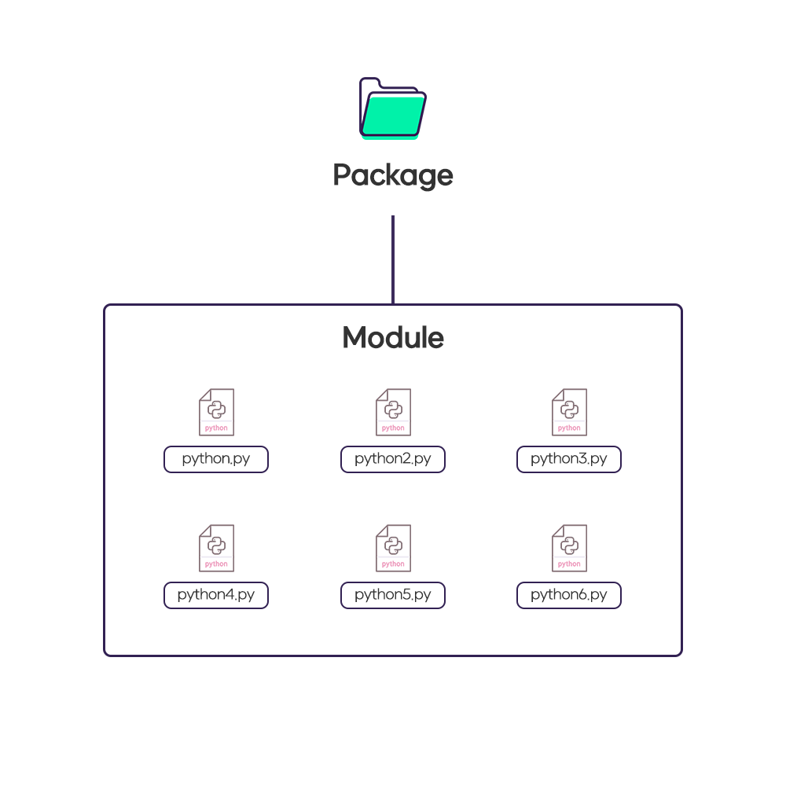

# -_Part1

## 😂 머리가 안따라줘서 이해시키려고 만드는 README 😂

### -2020-04-29-

### -2020-04-30-

#### 모듈과 패키지
*  *  *   *  *  
- 모듈 \
모듈은 쉽게 말해서 파일 이라고 볼 수 있겠다.
예를들면 python.py 이 자체가 하나의 모듈인 것이다.

- 패키지
파일에는 다양한 기능들을 담고 있을것이고 
그 파일들을 분류해서 모아놓으면 패키지가 되는것이다.

